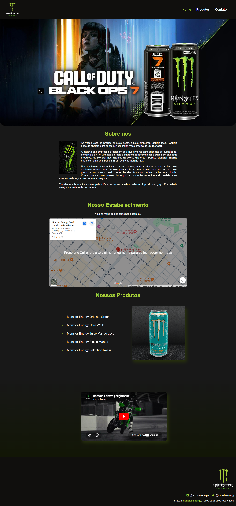
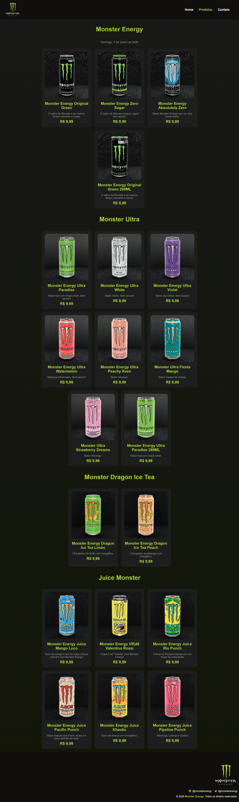
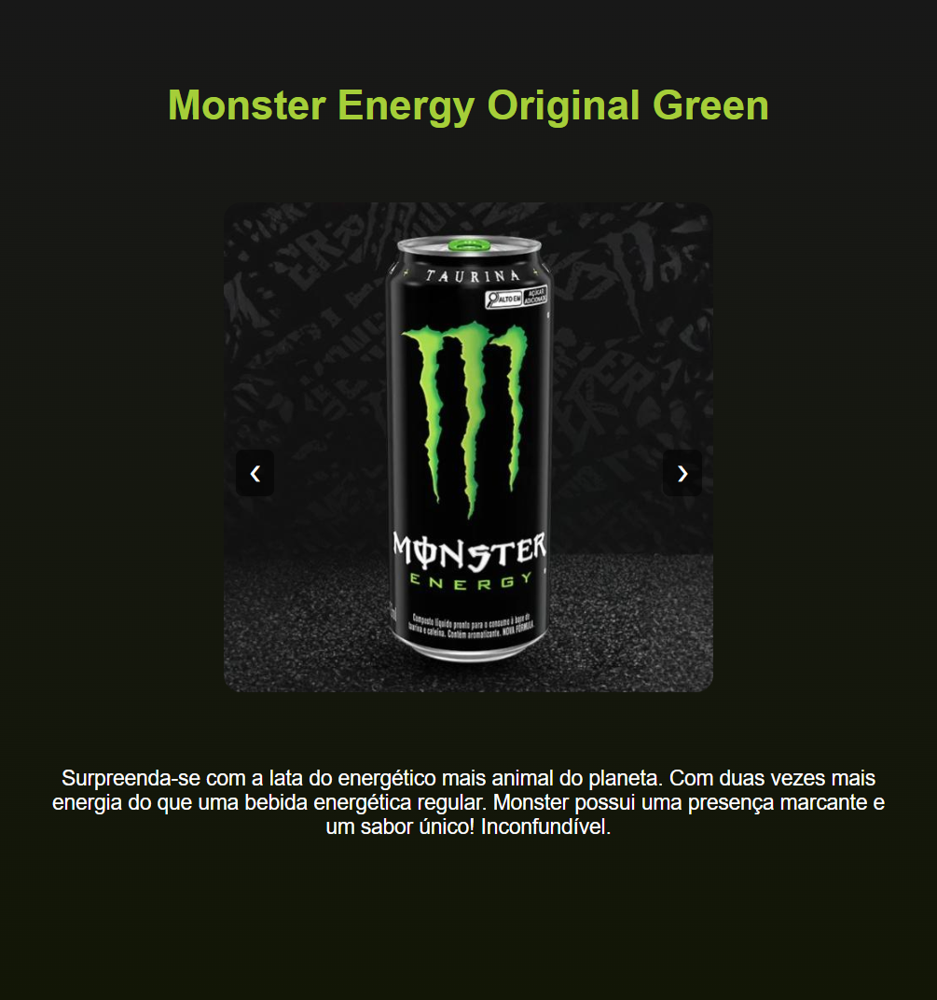
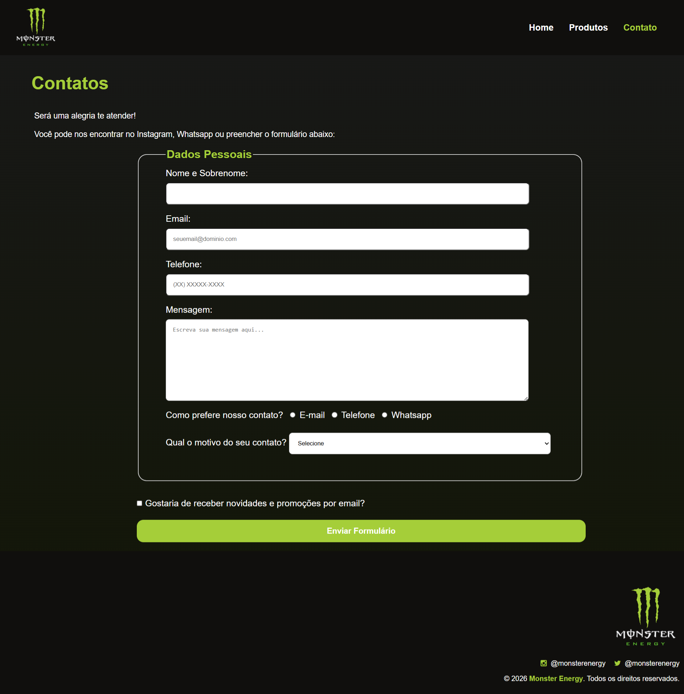

# Monster Web

Projeto Front-End desenvolvido durante o 1º semestre da graduação com o objetivo de aplicar os conhecimentos fundamentais de desenvolvimento web utilizando HTML, CSS e JavaScript.

## 🌐 Demonstração

Acesse o projeto online:

🔗 https://victorrmorenoo.github.io/projetoMonsterWeb/

## 📖 Sobre o Projeto

O Monster Web é um site inspirado na identidade visual da Monster Energy, desenvolvido para praticar conceitos de construção de interfaces web, estilização de páginas e interatividade com JavaScript.

O projeto apresenta uma experiência completa de navegação, incluindo página inicial, catálogo de produtos e formulário de contato.

## 🚀 Tecnologias Utilizadas

- HTML5
- CSS3
- JavaScript
- Git
- GitHub Pages

## ✨ Funcionalidades

- Exibição de catálogo de produtos
- Pop-up com informações dos produtos
- Formulário de contato com validação
- Exibição dinâmica de data utilizando JavaScript
- Integração com mapa
- Inclusão de conteúdo multimídia
- Navegação entre páginas

## 📂 Estrutura do Projeto

```text
projetoMonsterWeb/
│
├── css/
├── img/
├── js/
├── screenshots/
├── telas/
├── index.html
└── README.md
```

## 🎯 Objetivos de Aprendizagem

Durante o desenvolvimento deste projeto foram praticados conceitos como:

- Estruturação semântica com HTML
- Estilização utilizando CSS
- Manipulação do DOM com JavaScript
- Organização de arquivos em projetos web
- Criação de formulários
- Publicação de aplicações utilizando GitHub Pages
- Controle de versão com Git e GitHub

## 📸 Capturas de Tela

### Home



### Catálogo de Produtos



### Detalhes do Produto



### Contato



## 👨‍💻 Autor

Victor Moreno

- GitHub: https://github.com/victorrmorenoo
- LinkedIn: https://www.linkedin.com/

---

Projeto desenvolvido com fins acadêmicos para prática de desenvolvimento Front-End.